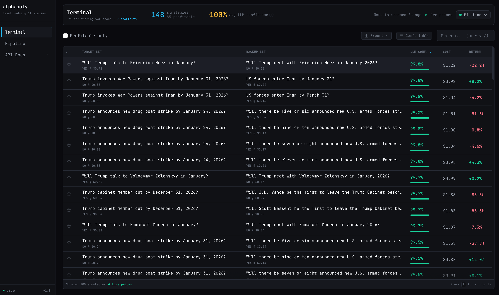

<p>
 <h3 align="center">Chainstack is the leading suite of services connecting developers with Web3 infrastructure</h3>
</p>

<p align="center">
  • <a target="_blank" href="https://chainstack.com/">Homepage</a> •
  <a target="_blank" href="https://chainstack.com/protocols/">Supported protocols</a> •
  <a target="_blank" href="https://chainstack.com/blog/">Chainstack blog</a> •
  <a target="_blank" href="https://docs.chainstack.com/quickstart/">Blockchain API reference</a> • <br> 
  • <a target="_blank" href="https://console.chainstack.com/user/account/create">Start for free</a> •
</p>


# Alphapoly - Polymarket alpha detection platform

Find covering portfolios across correlated prediction markets using predefined rules and LLM decisions. The system detects relationships between markets, classifies them to identify hedging pairs, and tracks their prices. The platform offers a smooth UI for entering detected pairs when profit opportunities exist and tracking your positions.

For a good experience, you'll need to add an LLM from OpenRouter and an RPC node (see `.env.example`).




## How It Works

1. **Groups** - Fetches multi-outcome markets from Polymarket (e.g., "Presidential Election Winner")
2. **Implications** *(LLM)* - Extracts logical relationships between groups
3. **Validation** *(LLM)* - Validates implications at the individual market level
4. **Portfolios** - Computes cost and expected profit for validated pairs using live market prices
5. **Positions** - Tracks your purchased position pairs

## Prerequisites

- [uv](https://docs.astral.sh/uv/) (manages Python automatically)
- **Node.js 18+** via [fnm](https://github.com/Schniz/fnm), nvm, or brew

## Quick Start

```bash
cp .env.example .env

# With make
make install && make dev

# Without make
cd backend && uv sync
cd frontend && npm install
cd backend && uv run python -m uvicorn server.main:app --port 8000 &
cd frontend && npm run dev
```

Dashboard: http://localhost:3000 · API: http://localhost:8000/docs

## Commands

**With make** (auto-detects fnm/nvm/volta):
```bash
make install    # Install deps
make dev        # Start both servers
make pipeline   # Run ML pipeline (incremental, also available in UI)
make lint       # Auto-fix: ruff + prettier + eslint
```

**Without make**:
```bash
# Backend
cd backend && uv sync
cd backend && uv run python -m uvicorn server.main:app --reload --port 8000

# Frontend
cd frontend && npm install
cd frontend && npm run dev
```

## Agentic Coding

This repo is configured for [Claude Code](https://docs.anthropic.com/en/docs/claude-code) via the `.claude/` directory:

- **`CLAUDE.md`** — project context, commands, conventions, and API routes
- **`hooks/`** — auto-lint on edit, guard against writing secrets
- **`skills/`** — workflows for pipeline management, trading, and feature development

Hooks and skills are Claude Code-specific. `CLAUDE.md` is also read by [GitHub Copilot in VS Code](https://code.visualstudio.com/docs/copilot/customization/custom-instructions#_use-a-claudemd-file) (opt-in via `chat.useClaudeMdFile`).

---

**Disclaimer:** This software is provided as-is for educational and research purposes only. It is not financial advice. Trading prediction markets involves risk—you may lose money. Use at your own discretion.
